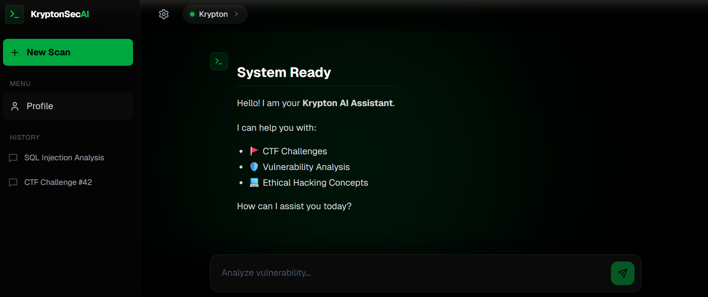

<div align="center">
  

  # KryptonSecAI

  Cybersecurity-focused AI platform with Retrieval-Augmented Generation, voucher-based access, and multi-model control.  
  A subproduct of KryptonX.

  <br />

  
  
  
  
  
  
</div>

## Overview
KryptonSecAI is built for security teams, researchers, and educators who need grounded answers, controlled access, and flexible model choice. It pairs a pgvector-backed RAG pipeline with a unified system prompt across user-selected models, then gates access using voucher-based subscriptions and role-based permissions.

## Features
- RAG pipeline with pgvector-backed search for grounded answers
- Multi-model chat with a unified system prompt and user-selected models
- Voucher-only access control with admin management
- Role-based authentication (admin/editor/user)
- Next.js 16 frontend and Rust Actix-Web backend

## Stack
- Frontend: Next.js (App Router), React 19, Tailwind CSS
- Backend: Rust, Actix-Web, SQLx
- Database: PostgreSQL + pgvector
- Embeddings: fastembed + ONNX Runtime

## Quick Start (Docker)
```bash
docker-compose up --build
```

Windows PowerShell:
```powershell
.\start-docker.ps1
```

Linux/macOS:
```bash
./start-docker.sh
```

Services:
- Frontend: http://localhost:3000
- Backend: http://localhost:8080
- Postgres: localhost:5432

## Local Development
Backend:
```bash
cd backend
cp .env.example .env
cargo run
```

Frontend:
```bash
cd frontend
npm install
npm run dev
```

## Environment Variables
Backend (.env):
- OPENROUTER_API_KEY
- JWT_SECRET
- DATABASE_URL (optional for local; Docker uses postgres service)

Frontend:
- NEXT_PUBLIC_API_URL (defaults to http://localhost:8080 in Docker)

## API Overview
- POST /api/auth/register
- POST /api/auth/login
- POST /api/vouchers/generate (admin)
- POST /api/vouchers/redeem
- POST /api/chat
- POST /api/admin/upload
- POST /api/admin/models

## Repository Layout
- backend: Rust API, RAG pipeline, and model orchestration
- frontend: Next.js UI
- docker-compose.yml: Postgres + backend + frontend stack
