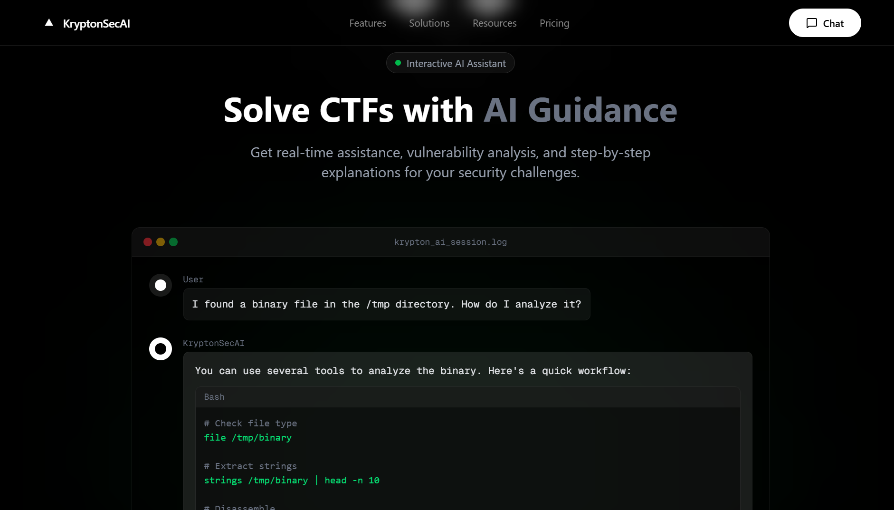
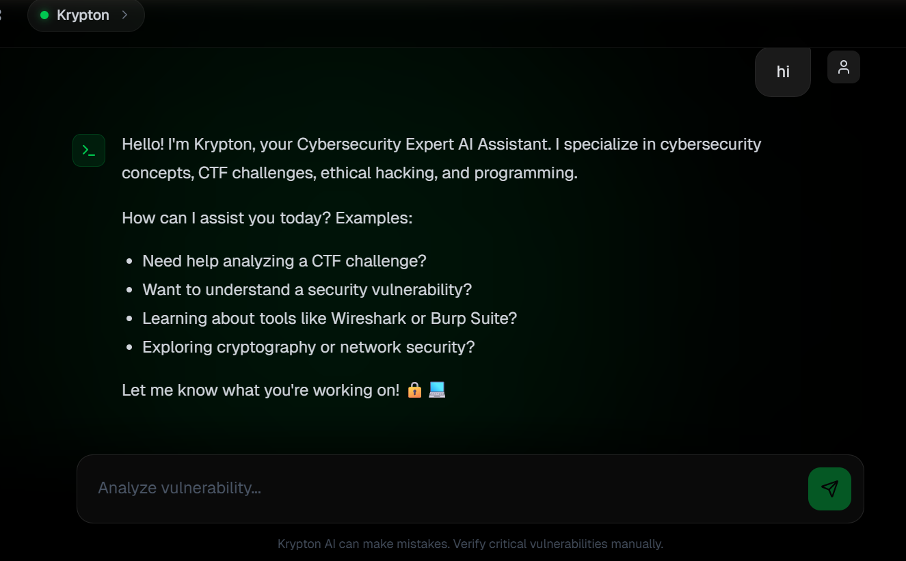
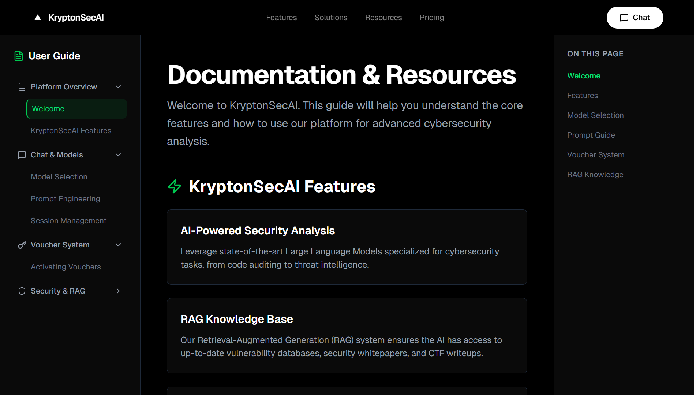
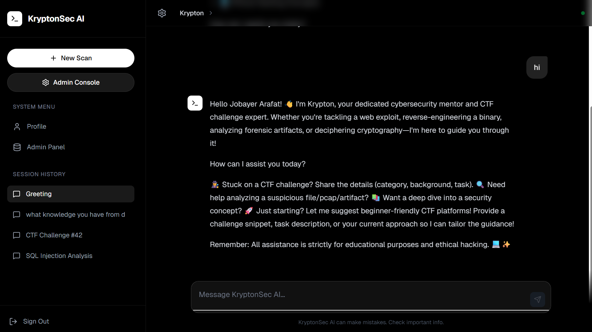

<div align="center">
  
  <h1>KryptonSecAI</h1>
  <p>
    <strong>Next-Gen AI Security Operations Platform</strong>
  </p>
  <p>
    Intelligent RAG Pipeline • Multi-Model Orchestration • Enterprise-Grade Security
  </p>

  <p>
    <a href="https://kryptonsecai.nextsoft.live"><strong>View Live Demo »</strong></a>
    <br />
    <br />
    <a href="#features">Features</a>
    ·
    <a href="#visual-tour">Visual Tour</a>
    ·
    <a href="#getting-started">Getting Started</a>
    ·
    <a href="#deployment">Deployment</a>
  </p>

  
  
  
  
</div>

<br />

## 🚀 Overview

**KryptonSecAI** is a cutting-edge security platform designed for SOC teams, researchers, and enterprises. It leverages **Retrieval-Augmented Generation (RAG)** to provide grounded, context-aware answers from your private knowledge base. With support for multiple LLMs, role-based access control, and a high-performance Rust backend, it delivers speed, security, and scalability.

## ✨ Key Features

- **🧠 Advanced RAG Engine**: Powered by `pgvector` and `fastembed` (ONNX Runtime) for precise semantic search and grounded responses.
- **🤖 Multi-Model Support**: Seamlessly switch between models (e.g., Llama 3, Mistral) with a unified system prompt.
- **🔐 Enterprise Security**:
  - **Voucher System**: Invite-only access control.
  - **RBAC**: Granular permissions (Admin, Editor, User).
  - **Email Verification**: Secure onboarding flow.
- **⚡ High Performance**:
  - **Rust Backend**: Built with Actix-Web for near-zero latency.
  - **Optimized Frontend**: Next.js App Router with Tailwind CSS.
- **📊 Admin Dashboard**: Manage users, vouchers, and knowledge base uploads.

## 📸 Visual Tour

### 1. Modern Landing Page
_Experience a sleek, developer-centric interface designed for cybersecurity professionals._


### 2. Intelligent Chat Assistant
_Interact with Krypton to analyze threats, debug code, and get real-time security insights._


### 3. Interactive CTF Guidance
_Solve Capture The Flag challenges with step-by-step AI guidance and vulnerability analysis._


### 4. Comprehensive Documentation
_Access a centralized knowledge base for platform features, prompt engineering, and RAG capabilities._


## 🛠️ Tech Stack

| Component | Technology | Description |
|-----------|------------|-------------|
| **Frontend** | Next.js 15, React 19 | Server-side rendering, App Router, Tailwind CSS |
| **Backend** | Rust, Actix-Web | High-performance async API, ONNX Runtime integration |
| **Database** | PostgreSQL + pgvector | Vector similarity search and relational data |
| **AI/ML** | FastEmbed, ONNX | Local embedding generation, dynamic model loading |
| **DevOps** | Docker, Nginx | Containerized deployment, reverse proxy |

## 🚀 Getting Started

### Prerequisites
- Docker & Docker Compose
- Node.js 18+ (for local frontend dev)
- Rust 1.75+ (for local backend dev)

### Quick Start (Docker)

1. **Clone the repository**
   ```bash
   git clone https://github.com/yourusername/kryptonsecai.git
   cd kryptonsecai
   ```

2. **Start the application**
   ```bash
   docker-compose up --build
   ```
   
   - **Frontend**: `http://localhost:3000`
   - **Backend**: `http://localhost:8080`

### Local Development

#### Backend (Rust)
```bash
cd backend
cp .env.example .env
cargo run
```

#### Frontend (Next.js)
```bash
cd frontend
npm install
npm run dev
```

## 🌍 Deployment

This project includes a production-ready `docker-compose.yml` and `nginx.conf`.

1. **Configure Environment**:
   Update `backend/.env` with your production URLs:
   ```env
   FRONTEND_BASE_URL=https://kryptonsecai.nextsoft.live
   DATABASE_URL=postgres://user:pass@db:5432/dbname
   ```

2. **Deploy**:
   ```bash
   ./deploy.sh
   ```

3. **Access**:
   The application will be available at `https://kryptonsecai.nextsoft.live`.

## 📜 License

This project is licensed under the MIT License - see the [LICENSE](LICENSE) file for details.

---

<div align="center">
  <p>Built with ❤️ by the NextSoft Team</p>
</div>
